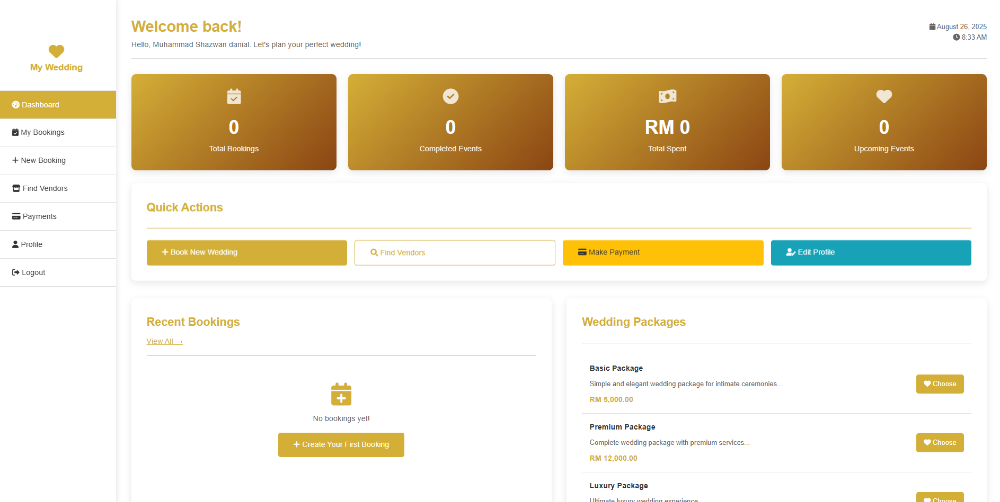

# 💒 Wedding Management System

A comprehensive web-based wedding planning and management system built with PHP, MySQL, and modern web technologies. This system enables wedding planners, customers, and vendors to collaborate seamlessly in creating perfect wedding experiences.


## 🌟 Features

### 🎯 Core Functionality
- **Multi-role Access Control** (Admin, Customer, Vendor)
- **Wedding Package Management** with customizable options
- **Vendor Network Integration** with rating system
- **Real-time Booking Management** with status tracking
- **Payment Processing & Tracking**
- **Event Timeline & Schedule Management**
- **Review & Rating System**
- **Automated Notifications**

### 👨‍💼 Admin Features
- **Dashboard Overview** with real-time statistics
- **Booking Management** (approve, modify, cancel)
- **Vendor Approval System**
- **Revenue Tracking & Analytics**
- **Customer Management**
- **Package Configuration**
- **System Reports**

### 👰 Customer Features
- **Personal Dashboard** with booking overview
- **Advanced Booking System** with package selection
- **Vendor Discovery & Selection**
- **Payment Management**
- **Event Timeline Tracking**
- **Review & Feedback System**
- **Mobile-Responsive Interface**

### 🏪 Vendor Features
- **Business Profile Management**
- **Booking Request Management**
- **Schedule Calendar**
- **Earnings Dashboard**
- **Customer Reviews**
- **Portfolio Management**

## 🛠️ Technology Stack

- **Backend:** PHP 7.4+ with PDO
- **Database:** MySQL 5.7+
- **Frontend:** HTML5, CSS3, JavaScript (ES6+)
- **Design:** Responsive CSS Grid & Flexbox
- **Icons:** Font Awesome 6.0
- **Security:** Password hashing, SQL injection prevention, XSS protection

## 📋 Requirements

- **PHP:** 7.4 or higher
- **MySQL:** 5.7 or higher
- **Web Server:** Apache/Nginx
- **Extensions:** PDO, PDO_MySQL
- **Browser:** Modern browsers (Chrome, Firefox, Safari, Edge)

## 🚀 Installation

### Step 1: Clone Repository
```bash
git clone https://github.com/shazwand989/wedding-management-system.git
cd wedding-management-system
```

### Step 2: Configure Web Server
Point your web server document root to the project directory.

For **XAMPP/WAMP/Laragon:**
- Place files in `htdocs/wedding-management-system/`
- Access via `http://localhost/wedding-management-system/`

### Step 3: Database Setup
1. Visit `http://localhost/wedding-management-system/install.php`
2. Enter your database credentials:
   - **Host:** localhost
   - **Username:** root (or your MySQL username)
   - **Password:** (your MySQL password)
   - **Database Name:** wedding_management
3. Click "Install Database"

### Step 4: Configuration (Optional)
Edit `includes/config.php` to customize:
- Database connection settings
- Site URL and name
- Application settings

## 🔑 Default Login Credentials

### Admin Account
- **Email:** admin@wedding.com
- **Password:** password

### Sample Vendor Accounts
- **Photographer:** photographer@example.com / password
- **Caterer:** caterer@example.com / password
- **Decorator:** decorator@example.com / password

> ⚠️ **Security Note:** Change default passwords immediately after installation!

## 📁 Project Structure

```
wedding-management-system/
├── 📁 admin/                  # Admin panel files
│   ├── dashboard.php          # Admin dashboard
│   └── ...
├── 📁 customer/               # Customer portal
│   ├── dashboard.php          # Customer dashboard
│   ├── new-booking.php        # Booking creation
│   └── ...
├── 📁 vendor/                 # Vendor portal
│   ├── dashboard.php          # Vendor dashboard
│   └── ...
├── 📁 assets/                 # Static assets
│   ├── 📁 css/               # Stylesheets
│   ├── 📁 js/                # JavaScript files
│   └── 📁 images/            # Images (if any)
├── 📁 includes/               # Core functionality
│   ├── config.php            # Database & app configuration
│   ├── ajax_handler.php      # AJAX request handler
│   └── ...
├── index.php                 # Public homepage
├── login.php                 # Login page
├── register.php              # Registration page
├── install.php               # Database installer
├── database.sql              # Database schema
└── README.md                 # This file
```

## 🗄️ Database Schema

The system uses a comprehensive database schema with 12 main tables:

- **users** - System users (admin, customers, vendors)
- **wedding_packages** - Predefined wedding packages
- **vendors** - Vendor business profiles
- **bookings** - Wedding booking records
- **booking_vendors** - Vendor assignments to bookings
- **payments** - Payment tracking
- **event_schedule** - Event timeline management
- **reviews** - Customer feedback
- **notifications** - System notifications

## 🎨 Screenshots

### Public Homepage


### Admin Dashboard


### Customer Booking


### Vendor Portal


## 🔧 Configuration

### Database Configuration
Edit `includes/config.php`:
```php
// Database settings
define('DB_HOST', 'localhost');
define('DB_USER', 'your_username');
define('DB_PASS', 'your_password');
define('DB_NAME', 'wedding_management');

// Application settings
define('SITE_URL', 'http://your-domain.com/');
define('SITE_NAME', 'Your Wedding Company');
```

### Email Configuration (Future Enhancement)
The system is prepared for email notifications. Configure SMTP settings in `includes/config.php` for production use.

## 🚦 Usage Guide

### For Customers:
1. **Register** an account as a customer
2. **Browse** available wedding packages
3. **Create** a new booking with preferred date and vendors
4. **Track** booking status and make payments
5. **Review** vendors after the event

### For Vendors:
1. **Register** as a vendor (requires admin approval)
2. **Complete** business profile with services and pricing
3. **Manage** incoming booking requests
4. **Update** availability and schedule
5. **Track** earnings and customer reviews

### For Administrators:
1. **Monitor** all bookings and revenue
2. **Approve** vendor registrations
3. **Manage** wedding packages and pricing
4. **Generate** reports and analytics
5. **Handle** customer support issues

## 🔒 Security Features

- **Password Hashing** using PHP's password_hash()
- **SQL Injection Prevention** with prepared statements
- **XSS Protection** with input sanitization
- **CSRF Protection** with form tokens
- **Role-based Access Control**
- **Session Security** with proper session management

## 🎯 API Endpoints

The system includes AJAX endpoints for dynamic functionality:

- `includes/ajax_handler.php` - Main AJAX request handler
- `includes/get_upcoming_events.php` - Fetch upcoming events
- Additional endpoints for real-time updates

## 🧪 Testing

### Manual Testing
1. Test user registration for all roles
2. Create sample bookings with different packages
3. Test vendor approval workflow
4. Verify payment tracking functionality
5. Test responsive design on mobile devices

### Test Data
The installation includes sample data:
- 3 wedding packages (Basic, Premium, Luxury)
- 3 sample vendors with different service types
- Demo accounts for testing

## 🔄 Future Enhancements

- [ ] Email notification system
- [ ] Online payment gateway integration
- [ ] Calendar synchronization (Google Calendar, Outlook)
- [ ] Mobile app development
- [ ] Advanced reporting and analytics
- [ ] Multi-language support
- [ ] Document management system
- [ ] Real-time chat system
- [ ] Social media integration
- [ ] Advanced search and filtering

## 🤝 Contributing

1. **Fork** the repository
2. **Create** a feature branch (`git checkout -b feature/AmazingFeature`)
3. **Commit** your changes (`git commit -m 'Add some AmazingFeature'`)
4. **Push** to the branch (`git push origin feature/AmazingFeature`)
5. **Open** a Pull Request

### Coding Standards
- Follow PSR-12 coding standards for PHP
- Use meaningful variable and function names
- Comment complex logic
- Maintain consistent indentation
- Test thoroughly before submitting

## 📞 Support

For support and questions:
- **Email:** support@weddingmanagement.com
- **GitHub Issues:** [Create an issue](https://github.com/shazwand989/wedding-management-system/issues)
- **Documentation:** Check the code comments and this README

## 📄 License

This project is licensed under the MIT License - see the [LICENSE.md](LICENSE.md) file for details.

## 👥 Authors

- **Your Name** - *Initial work* - [YourGitHub](https://github.com/shazwand989)

## 🙏 Acknowledgments

- Font Awesome for beautiful icons
- Modern CSS Grid and Flexbox for responsive layouts
- PHP community for excellent documentation
- Wedding industry professionals for requirements insights

---

### 💡 Pro Tips

1. **Regular Backups:** Always backup your database regularly
2. **Security Updates:** Keep PHP and MySQL updated
3. **Performance:** Consider adding caching for better performance
4. **Monitoring:** Set up monitoring for production environments
5. **Documentation:** Keep API documentation updated as you add features

---

**Made with ❤️ for the wedding industry**

*Creating beautiful memories, one wedding at a time.*
